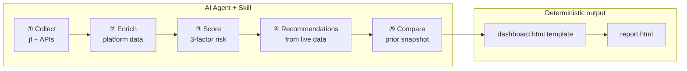
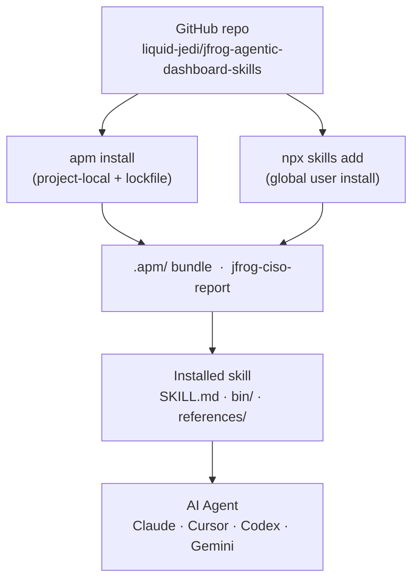
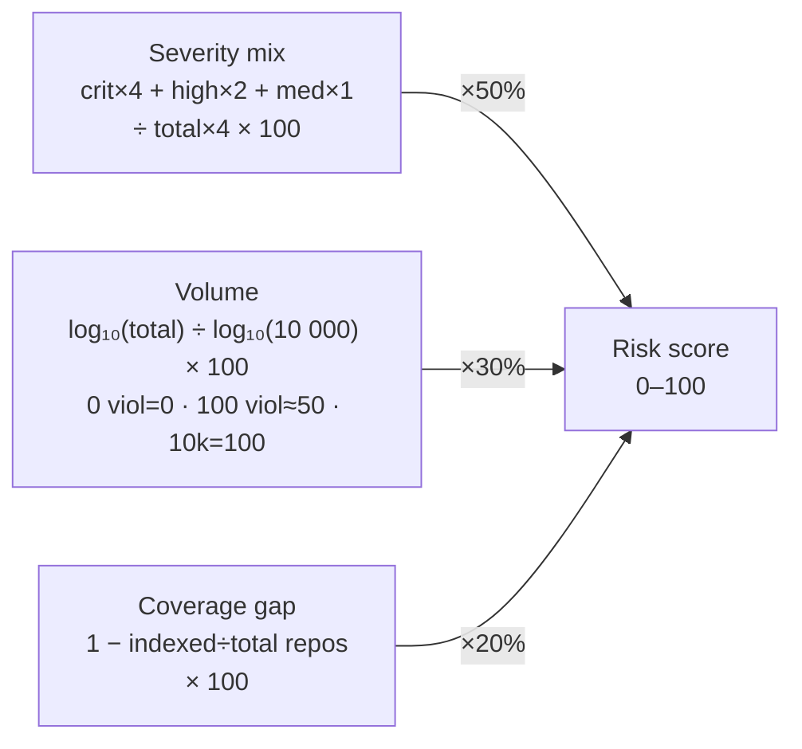

# JFrog CISO Dashboard Skill

> **Live security dashboards for JFrog Platform** — generated by AI agents, rendered through a fixed HTML template. One prompt → one self-contained HTML report.

[](#)
[](docs/INSTALL.md)
[](docs/INSTALL.md)
[](docs/INSTALL.md)

CISOs need a different slice of JFrog Platform data than engineers do. This repository ships a **Skill** that agents use to collect live data, enrich it, score it, and render a **branded, self-contained HTML** report — the same template every run, every environment.

## How it works



The agent **never generates HTML from scratch** — it produces structured JSON, which is injected into the versioned template. Presentation is always consistent; only the data changes.

---

## What's in the report

Single self-contained HTML — open in a browser, email to stakeholders, or archive in Artifactory.

| Tab | Contents |
|-----|----------|
| **Overview** | Executive KPI strip, gate summary, risk gauge with score breakdown |
| **Curation** | Evaluated / blocked / approved, block reasons, audit trail, policy inventory |
| **Xray** | Violations by type & severity, 3-factor risk score, critical issue list |
| **Governance** | Policy effectiveness, watch coverage, period-over-period comparison |
| **Recommendations** | P1/P2/P3 actions generated from live data with effort ratings |

---

## Install

Two supported paths — both reach the same `.apm/` skill bundle on GitHub:



### Prerequisites

Before installing the skill, make sure these are available:

| Requirement | Check |
|-------------|-------|
| JFrog Platform with Xray | `jf rt ping --server-id <id>` |
| JFrog CLI configured | `jf config show` |
| `python3` | `python3 --version` |
| `jq` | `jq --version` |
| Base `jfrog` skill | `npx skills list -g` |

Install the base skill if missing:

```bash
npx skills add jfrog -g -y
```

### Option A — APM (project-local, recommended for teams)

Best when you want a lockfile and reproducible installs checked into a reporting workspace.

```bash
# 1. Install APM
curl -sSL https://aka.ms/apm-unix | sh

# 2. Create a reporting workspace
mkdir -p ~/ciso-reporting && cd ~/ciso-reporting
apm init -y --target claude,codex,cursor

# 3. Install the skill
apm install liquid-jedi/jfrog-agentic-dashboard-skills/packages/apm/jfrog-ciso-report#v2.5.0
```

**Verify APM install:**

```bash
cd ~/ciso-reporting

# List installed skills and versions
apm dep list

# Confirm skill files are present
find .agents/skills/jfrog-ciso-report -maxdepth 2 | sort
```

Expected output:
```
jfrog-ciso-report  2.5.0  (local)

.agents/skills/jfrog-ciso-report
.agents/skills/jfrog-ciso-report/SKILL.md
.agents/skills/jfrog-ciso-report/bin
.agents/skills/jfrog-ciso-report/bin/generate-ciso-report.sh
.agents/skills/jfrog-ciso-report/internal
.agents/skills/jfrog-ciso-report/references
.agents/skills/jfrog-ciso-report/references/dashboard.html
```

### Option B — global Skills install (run from anywhere)

Best for individual users who want to open any agent from any directory.

```bash
npx skills add git@github.com:liquid-jedi/jfrog-agentic-dashboard-skills.git -g --skill jfrog-ciso-report
```

**Verify global install:**

```bash
npx skills list -g | grep jfrog
```

Expected: both `jfrog` and `jfrog-ciso-report` appear in the list.

### Option C — local clone (development)

```bash
git clone https://github.com/liquid-jedi/jfrog-agentic-dashboard-skills.git
cd jfrog-agentic-dashboard-skills
REPO_ROOT="$(pwd)"
npx skills add "$REPO_ROOT" -g --skill jfrog-ciso-report
```

Full install guidance → **[docs/INSTALL.md](docs/INSTALL.md)**

---

## Run the readiness check

Before the first report run, validate your environment:

```bash
bash scripts/agentic-dashboard-prechecks.sh
```

This checks tools on PATH, JFrog CLI server config, and skill installation. Fix any failures before continuing.

---

## Run a report

Ask your agent:

```
Generate a monthly CISO report for server solenglatest. Save under ~/ciso-reports.
```

```
Generate a weekly CISO report. Local only.
```

```
Generate a CISO report for 2026-05-01 to 2026-05-31.
```

### Output folder layout

Both local and Artifactory storage follow the same `<server-id>/<report-type>/<date>/` path convention so you can compare or browse either location with the same mental model.

| | Local (`~/ciso-reports/`) | Artifactory (`ciso-reports-local/`) |
|-|--------------------------|-------------------------------------|
| **report.html** | ✅ Generated every run | ✅ Uploaded on request |
| **snapshot.json** | ✅ Compact KPI snapshot for trend comparison | ✅ Uploaded — used for prior-period comparison |
| **data.json** | ✅ Full enriched payload (debug/audit) | ❌ Not uploaded |
| **run-meta.json** | ✅ Run timestamp, env, skill version | ❌ Not uploaded |
| **manifest.json** | ❌ | ✅ Server-level index of all runs |
| **rerun-HHMMSS/** | ✅ Same-day reruns land here | ❌ |

```
LOCAL (~/ciso-reports/)               ARTIFACTORY (ciso-reports-local/)
──────────────────────────────────    ────────────────────────────────────────
<server-id>/                          <server-id>/
├── weekly/                           ├── manifest.json   ← index of all runs
│   └── 2026-06-14/                   ├── weekly/
│       ├── report.html               │   └── 2026-06-14/
│       ├── data.json                 │       ├── report.html
│       ├── snapshot.json             │       └── snapshot.json
│       ├── run-meta.json             └── monthly/
│       └── rerun-153012/                 └── 2026-06-01/
│           ├── report.html                   ├── report.html
│           ├── data.json                     └── snapshot.json
│           ├── snapshot.json
│           └── run-meta.json
└── monthly/
    └── 2026-06-01/
        ├── report.html
        ├── data.json
        ├── snapshot.json
        └── run-meta.json
```

Same-day reruns land in `rerun-HHMMSS/` locally — prior runs are never overwritten. Artifactory uploads always use the canonical date path (no rerun dirs).

### Hands-free mode

If your agent prompts for confirmation on every tool call, start it in auto-approve mode first:

| Agent | Command |
|-------|---------|
| Claude | `claude --permission-mode dontAsk` |
| Codex | `codex -a never` |
| Gemini | `gemini --approval-mode yolo` |
| Cursor / Cline / Windsurf | Use workspace auto-approve setting |

> **Safety note:** auto-approve reduces confirmations. Use only in trusted workspaces with non-destructive commands.

---

## Documentation

| Doc | Contents |
|-----|----------|
| [**Installation**](docs/INSTALL.md) | APM vs global install, verification, first run |
| [**CISO user manual**](docs/ciso-user-manual.md) | Permissions, runtime behavior, interpretation, tuning |
| [**Troubleshooting**](docs/TROUBLESHOOTING.md) | Common issues and compatibility |

---

## Repository layout

```text
Dashboard-ciso-report-skills/    # Skill source — SKILL.md, bin/, internal/, references/
packages/apm/
└── jfrog-ciso-report/           # APM-installable bundle (synced from skill source)
docs/                            # Operator guides
examples/                        # Example generated HTML reports (open in browser)
scripts/                         # Prechecks and utilities
```

## Example reports

The `examples/` folder contains static HTML reports generated from real report payloads.

- Open any `.html` file directly in a browser — they are self-contained.
- Use them to review layout and section ordering before connecting to a live instance.
- `examples/ciso-reports/weekly/report-1.html`
- `examples/ciso-reports/monthly/report-1.html`

---

## What's new

**v2.5.0 (June 2026)**
- **3-factor risk score** — replaces the old count-invariant formula (1 critical = 1,000 critical = 100/100):



- **Score breakdown in gauge** — live component breakdown shown below the ring chart
- **5-tab dashboard** — Overview, Curation, Xray, Governance, Recommendations; fonts inlined, fully self-contained
- **Data-driven recommendations** — P1/P2/P3 generated from live data after enrichment (real XRAY IDs, hit counts, coverage gaps)
- **Period-over-period comparison** — runner scans prior snapshots and computes curation/violation deltas automatically
- **Show all / fewer toggle** — fixed on long tables in Curation and Xray tabs

**v2.3.0 and earlier**
- Instance-aware filenames and safe same-day reruns (`rerun-HHMMSS/`)
- Structured local artifacts: `report.html`, `snapshot.json`, `run-meta.json`
- Stable local-root bootstrap on first run (or set `CISO_LOCAL_ROOT` up front)
- Severity panel concentration metrics

---

**Author:** Avinash Giri · **License:** [Apache 2.0](LICENSE)
