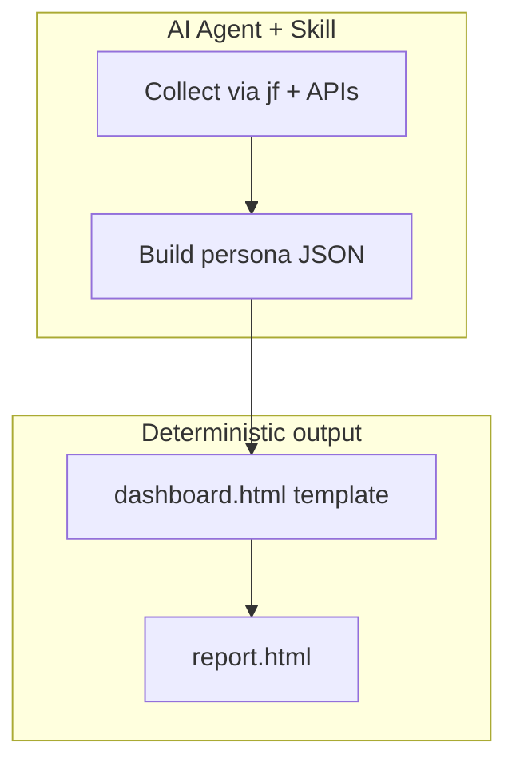

# JFrog Agentic Dashboard Skills

> **Persona-specific security dashboards from live JFrog Platform data** — generated by AI agents, rendered through a fixed HTML template.

[](docs/INSTALL.md)
[](docs/INSTALL.md)
[](docs/INSTALL.md)

Every organization needs different reports. CISOs, engineering leads, and compliance officers all want a different slice of the same platform. This repository delivers **Skills** that agents use to collect live data, build structured JSON, and render **branded, self-contained HTML** dashboards on demand.



---

## Skills in this repo

| Skill | Purpose |
|-------|---------|
| **`jfrog-ciso-report`** | CISO Security & Curation dashboard (production) |
| **`jfrog-dashboard-blueprint`** | Scaffold new persona packs from an interview |

---

## CISO dashboard at a glance

Single HTML file — open in a browser, email to stakeholders, or archive in Artifactory.

| Area | Highlights |
|------|------------|
| **Supply chain (Curation)** | Evaluated / blocked / approved, blocks by reason, audit trail |
| **Vulnerabilities (Xray)** | Violations by type & severity, risk score, critical issue list with context |
| **Compliance** | License and operational risk breakdowns |
| **Executive** | KPI strip, curation vs detection value, recommendations with metadata |
| **Governance (beta)** | Policy effectiveness, watch coverage, threat velocity trends |

---

## Quick start

**1. Prerequisites** — JFrog Platform with Xray, `jf` CLI, `jq`, `python3`, and the base [`jfrog`](https://github.com/jfrog/jfrog-skills) skill.

**2. Install the base skill:**

```bash
npx skills add jfrog -g -y
```

**3. Install `jfrog-ciso-report`**

From GitHub:

```bash
npx skills add git@github.com:liquid-jedi/jfrog-agentic-dashboard-skills.git -g --skill jfrog-ciso-report
```

From a local clone (for development):

```bash
REPO_ROOT="$(pwd)"
npx skills add "$REPO_ROOT" -g --skill jfrog-ciso-report
```

**4. Verify the install:**

```bash
npx skills list -g
```

Expected result: the global skills list includes both `jfrog` and `jfrog-ciso-report`.

**Current shipped versions:** `jfrog-ciso-report` `2.1.0`, `jfrog-dashboard-blueprint` `2.1.0`.

**5. Run the readiness check** (recommended for local-clone installs):

```bash
REPO_ROOT="$(pwd)"
bash "$REPO_ROOT/scripts/agentic-dashboard-prechecks.sh"
```

**6. Run** — ask your agent:

```
Generate a weekly CISO report
```

Full install options, GitHub installs, and verification → **[docs/INSTALL.md](docs/INSTALL.md)**

---

## Why agentic reporting?

- **Live data** — reports reflect current platform state, not static exports  
- **Customer-defined priorities** — tune scoring and thresholds in the JSON contract  
- **Consistent UX** — same template every run for comparable executive output  
- **Portable** — works across Claude Code, Cursor, Cline, Windsurf, Amp, and other Skills-capable agents  
- **Inspectable** — JSON-first pipeline is testable and auditable  
- **Extensible** — new personas = new skill + mapping, not a new product  

---

## Documentation

| Doc | Contents |
|-----|----------|
| [**Installation**](docs/INSTALL.md) | Install, verify, update, prechecks, and first report run |
| [**Architecture**](docs/ARCHITECTURE.md) | Data flow, execution contract, file map, new personas |
| [**CISO user manual**](docs/ciso-user-manual.md) | Permissions, agents, interpretation, tuning |
| [**Beta schema**](docs/BETA-SCHEMA.md) | Schema 2.0-beta migration for custom producers |
| [**Troubleshooting**](docs/TROUBLESHOOTING.md) | Common issues and compatibility |

---

## Repository layout

```text
Dashboard-ciso-report-skills/               # CISO skill + renderer
dashboard-blueprint-skills/                 # Persona scaffolder
docs/                                       # Operator guides
samples/                                    # Example HTML reports
scripts/agentic-dashboard-prechecks.sh      # Install / runtime checker
```

---

## Recent highlights

- Instance-aware filenames and safe same-day reruns (`rerun-HHMMSS/`)
- Structured local artifacts: `report.html`, `snapshot.json`, `run-meta.json`
- Stable local-root bootstrap on first run (or set `CISO_LOCAL_ROOT` up front)
- Severity panel concentration metrics; resilient curation audit when row events are sparse

**Author:** Avinash Giri

---

## License

See [LICENSE](LICENSE).
