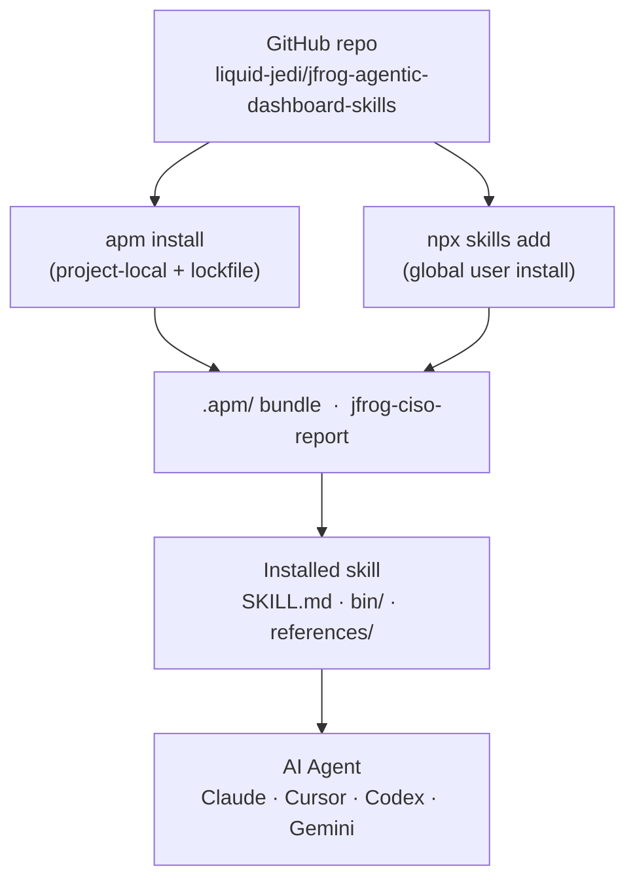

# JFrog CISO Dashboard Skill

> **Live security dashboards for JFrog Platform** — generated by AI agents, rendered through a fixed HTML template. One prompt → one self-contained HTML report.

[](#whats-new)
[](docs/INSTALL.md)
[](docs/INSTALL.md)
[](docs/INSTALL.md)

CISOs need a different slice of JFrog Platform data than engineers do. This repository ships a **Skill** that agents use to collect live data, enrich it into executive posture signals and actionable insights, and render a **branded, self-contained HTML** report — the same template every run, every environment.

## How it works


The agent **never generates HTML from scratch** — it produces structured JSON, which is injected into the versioned template. Presentation is always consistent; only the data changes.

---

## What's in the report

Single self-contained HTML — open in a browser, email to stakeholders, or archive in Artifactory.

| Tab | Contents |
|-----|----------|
| **Overview** | Executive KPI strip, independent posture signals, threat velocity trend cards, SLA/fixability/coverage insight cards, top actions |
| **Curation** | Gate results, supported-ecosystem coverage gaps, enforcement opportunity, malicious package defense, blocks by Curation policy, active users |
| **Xray** | Severity distribution, SLA backlog, remediation readiness, highest-impact fixes, watch blind spots, blast radius, critical issue list |
| **Recommendations** | P1/P2/P3 actions generated from live data with effort ratings |

Alongside the HTML, each run can emit two PDFs — a concise `executive-report.pdf`
for sharing and a detailed `full-report.pdf` for internal review. See
[PDF export modes](#pdf-export-modes).

---

## Install

**Recommended: Option A (APM)** — project-local with a lockfile, reproducible
across a team. Option B (global Skills) is best for individual use from any
folder; two narrower paths (local-clone development, offline zip) cover the
rest. Full commands and verification for all four are in
**[docs/INSTALL.md](docs/INSTALL.md)**.

The two most common paths — APM and global Skills — both resolve to the same
`.apm/` skill bundle on GitHub:



### Prerequisites

Before installing the skill, make sure these are available:

| Requirement | Check |
|-------------|-------|
| JFrog Platform with Xray | `jf rt ping --server-id <id>` |
| JFrog CLI configured | `jf config show` |
| `python3` | `python3 --version` |
| `jq` | `jq --version` |
| `node` (PDF export) | `node --version` |
| Chrome / Chromium / Edge (PDF export) | Auto-detected, or set `CISO_CHROME_BIN` |
| Base `jfrog` skill | `npx skills list -g` |

PDF export is part of every run, so `node` and a browser are required. The
renderer uses Puppeteer when installed, otherwise it drives an already-installed
Google Chrome, Chromium, or Microsoft Edge — nothing is downloaded mid-run. If
the browser lives somewhere non-standard, point `CISO_CHROME_BIN` at it.

Install the base skill if missing:

```bash
npx skills add jfrog -g -y
```

### Option A — APM (project-local, recommended for teams)

Best when you want a lockfile and reproducible installs checked into a reporting workspace.

```bash
# 1. Install APM
curl -sSL https://aka.ms/apm-unix | sh

# 2. Create a reporting workspace
mkdir -p ~/ciso-reporting && cd ~/ciso-reporting
apm init -y --target claude,codex,cursor

# 3. Install the skill
apm install liquid-jedi/jfrog-agentic-dashboard-skills/packages/apm/jfrog-ciso-report#v4.2.0
```

Need an older tagged release instead? Use `#v3.0.0`, not `#v4.0.0` — the
Claude guardrail in v4.0.0 shipped with an invalid `settings.json` and never
loaded, which is what v4.0.1 fixes.

```bash
apm install liquid-jedi/jfrog-agentic-dashboard-skills/packages/apm/jfrog-ciso-report#v3.0.0
```

**Verify APM install:**

```bash
cd ~/ciso-reporting

# List installed skills and versions
apm dep list

# Confirm skill files are present
find .agents/skills/jfrog-ciso-report -maxdepth 2 | sort
```

Expected output:
```
jfrog-ciso-report  4.2.0  (local)

.agents/skills/jfrog-ciso-report
.agents/skills/jfrog-ciso-report/SKILL.md
.agents/skills/jfrog-ciso-report/bin
.agents/skills/jfrog-ciso-report/bin/generate-ciso-pdf.js
.agents/skills/jfrog-ciso-report/bin/generate-ciso-report.sh
.agents/skills/jfrog-ciso-report/internal
.agents/skills/jfrog-ciso-report/references
.agents/skills/jfrog-ciso-report/references/dashboard-pdf-full.html
.agents/skills/jfrog-ciso-report/references/dashboard-pdf.html
.agents/skills/jfrog-ciso-report/references/dashboard.html
```

If APM stops with **"No harness detected"**, you are installing into a folder
with no agent markers. Add `--target claude,cursor,codex` to the install
command, or declare `targets:` in `apm.yml`.

### Option B — global Skills install (run from anywhere)

Best for individual users who want to open any agent from any directory.

```bash
npx skills add git@github.com:liquid-jedi/jfrog-agentic-dashboard-skills.git -g --skill jfrog-ciso-report
```

Verify: `npx skills list -g | grep jfrog` should list both `jfrog` and `jfrog-ciso-report`.

### Other install paths

| Path | Best for |
|------|----------|
| **Local clone** (development) | Editing the skill itself — changes take effect immediately, no stale copies |
| **Offline zip bundle** | Restricted networks that can't reach GitHub |

Full commands and verification for both, plus everything above →
**[docs/INSTALL.md](docs/INSTALL.md)**

---

## Run the readiness check

Before the first report run, validate your environment:

```bash
bash scripts/agentic-dashboard-prechecks.sh
```

This checks tools on PATH, JFrog CLI server config, and skill installation. Fix any failures before continuing.

---

## Run a report

Ask your agent, for example:

```text
Generate a monthly CISO report for server solenglatest. Save under ~/ciso-reports.
Generate a weekly CISO report. Local only.
Generate a weekly CISO report for the first week of May 2026 for server solenglatest. Save under ~/ciso-reports.
Generate a weekly CISO report for the second week of June 2026 for server solenglatest. Save under ~/ciso-reports.
Generate a CISO report for 2026-05-01 to 2026-05-31.
```

Historical weekly reports save under the week being reported, not the day they
were generated. For example, the second week of June 2026 saves to
`~/ciso-reports/<server>/weekly/2026-06-14/`.

### Historical weekly date rules

When you ask for an ordinal week of a month, the report uses calendar blocks
starting on day 1 of that month. Weeks do not roll over from the prior month.

| Prompt | Date window | `REPORT_DATE` / folder date |
|-|-|-|
| First week of May 2026 | May 1 - May 7 | `2026-05-07` |
| Second week of May 2026 | May 8 - May 14 | `2026-05-14` |
| Third week of May 2026 | May 15 - May 21 | `2026-05-21` |
| Fourth week of May 2026 | May 22 - May 28 | `2026-05-28` |
| Fifth week of May 2026 | May 29 - May 31 | `2026-05-31` |
| First week of June 2026 | June 1 - June 7 | `2026-06-07` |

For partial final weeks, `DATE_TO` is the last day of the month at
`23:59:59Z`. For example, the fifth week of May 2026 uses:

```bash
DATE_FROM=2026-05-29T00:00:00Z
DATE_TO=2026-05-31T23:59:59Z
REPORT_DATE=2026-05-31
```

### Output folder layout

Both local and Artifactory storage follow the same `<server-id>/<report-type>/<date>/` path convention so you can compare or browse either location with the same mental model.

| | Local (`~/ciso-reports/`) | Artifactory (`ciso-reports-local/`) |
|-|--------------------------|-------------------------------------|
| **report.html** | ✅ Generated every run | ✅ Uploaded on request |
| **executive-report.pdf** | ✅ Generated when `CISO_PDF_MODE` is unset, `executive`, or `both` | ✅ Uploaded on request |
| **full-report.pdf** | ✅ Generated when `CISO_PDF_MODE=full` or `both` | ✅ Uploaded only when requested |
| **snapshot.json** | ✅ Compact KPI snapshot for trend comparison | ✅ Uploaded — used for prior-period comparison |
| **data.json** | ✅ Full enriched payload (debug/audit) | ❌ Not uploaded |
| **curation-user-package-activity.csv** | ✅ One row per active Curation user, with block rate, package breadth and top packages | ❌ Not uploaded |
| **run-meta.json** | ✅ Run timestamp, env, skill version | ❌ Not uploaded |
| **manifest.json** | ❌ | ✅ Server-level index of all runs |
| **rerun-HHMMSS/** | ✅ Same-day reruns land here | ❌ |

```
LOCAL (~/ciso-reports/)               ARTIFACTORY (ciso-reports-local/)
──────────────────────────────────    ────────────────────────────────────────
<server-id>/                          <server-id>/
├── weekly/                           ├── manifest.json   ← index of all runs
│   └── 2026-06-14/                   ├── weekly/
│       ├── report.html               │   └── 2026-06-14/
│       ├── executive-report.pdf      │       ├── report.html
│       ├── full-report.pdf           │       ├── executive-report.pdf
│       ├── data.json                 │       ├── full-report.pdf
│       ├── curation-user-package-activity.csv
│       ├── snapshot.json             │       └── snapshot.json
│       ├── run-meta.json             └── monthly/
│       └── rerun-153012/                 └── 2026-06-01/
│           ├── report.html                   ├── report.html
│           ├── executive-report.pdf          ├── executive-report.pdf
│           ├── full-report.pdf               └── snapshot.json
│           ├── data.json
│           ├── curation-user-package-activity.csv
│           ├── snapshot.json
│           └── run-meta.json
└── monthly/
    └── 2026-06-01/
        ├── report.html
        ├── executive-report.pdf
        ├── full-report.pdf
        ├── data.json
        ├── curation-user-package-activity.csv
        ├── snapshot.json
        └── run-meta.json
```

Same-day reruns land in `rerun-HHMMSS/` locally — prior runs are never overwritten. Artifactory uploads always use the canonical date path (no rerun dirs).

### PDF export modes

The runner always writes `report.html`. PDF export is controlled by `CISO_PDF_MODE`:

| Mode | Output |
|-|-|
| unset or `executive` | `executive-report.pdf` is a concise CISO-shareable PDF |
| `full` | `full-report.pdf` is the detailed internal PDF |
| `both` | `executive-report.pdf` and `full-report.pdf` |

Any other value fails the run immediately, so PDF rendering cannot be skipped —
`node` and a Chrome-compatible browser must be available. Rendered PDFs are
size- and signature-checked before a run is considered successful.

The executive PDF is deliberately narrower than the HTML dashboard: it carries
the KPI strip, posture signals, Curation gate results with active user counts,
and the decisions needing leadership attention, while operational detail stays
in the full PDF and the HTML report.

### Agent efficiency and guardrails

This repository includes project-level Boost filters in `.boost/filters.toml`
for the CISO report runner and JFrog CLI output. Boost reduces terminal-output
noise and estimates saved tokens; it does not replace security controls or
report validation.

Project-level guardrails are provided for Cursor, Claude Code, Codex, and
Antigravity:

- Cursor: `.cursor/hooks.json` -> `.cursor/hooks/ciso-report-guardrail.sh`
- Claude Code: `.claude/settings.json` -> `.claude/hooks/ciso-report-guardrail-claude.sh`
- Codex: `.codex/config.toml` + `.codex/hooks.json` -> `.codex/hooks/ciso-report-guardrail-codex.sh`
- Antigravity: `.agents/hooks.json` -> `.agents/hooks/ciso-report-guardrail-antigravity.sh`

The guardrail is separate from Boost: it blocks destructive JFrog curl methods,
prompts or denies report publication unless explicitly enabled, and keeps
cleanup scoped to report artifacts and `/tmp/ciso-*`. Codex requires hook
support to be enabled/trusted by the CLI before project hooks run.

`run-meta.json` records best-effort agent and token metadata. The runner reads
`CISO_TOTAL_TOKENS`, detailed token env vars, `CISO_TOKEN_USAGE_PATH`,
`/tmp/ciso-token-usage.json`, or a Claude transcript path when supplied. If no
source is available, token usage is marked `unavailable` and Claude users can
run `/usage` for a manual session total.

### Hands-free mode

If your agent prompts for confirmation on every tool call, start it in auto-approve mode first:

| Agent | Command |
|-------|---------|
| Claude | `claude --permission-mode dontAsk` |
| Codex | `codex -a never` |
| Gemini | `gemini --approval-mode yolo` |
| Cursor / Cline / Windsurf | Use workspace auto-approve setting |

> **Safety note:** auto-approve reduces confirmations. Use only in trusted workspaces with non-destructive commands.

---

## Documentation

| Doc | Contents |
|-----|----------|
| [**Installation**](docs/INSTALL.md) | APM vs global install, verification, first run |
| [**CISO user manual**](docs/ciso-user-manual.md) | Permissions, runtime behavior, interpretation, tuning |
| [**Troubleshooting**](docs/TROUBLESHOOTING.md) | Common issues and compatibility |

---

## Repository layout

```text
Dashboard-ciso-report-skills/    # Skill source — SKILL.md, bin/, internal/, references/
packages/apm/
└── jfrog-ciso-report/           # APM-installable bundle (synced from skill source)
    └── extras/agent-support/    # Optional Boost filters + guardrail hooks per agent
docs/                            # Operator guides
Example Reports/                 # Real v4.2.0 output: HTML, executive + full PDF, CSV
scripts/                         # Prechecks and utilities
.boost/                          # Boost output filters for this repo
.cursor/ .claude/ .codex/ .agents/  # Per-agent guardrail hooks
```

## Example reports

`Example Reports/ciso-reports/` holds real v4.2.0 output, so you can see exactly
what a run produces before connecting to your own instance. The HTML files are
self-contained — open them straight in a browser.

| File | What it shows |
|------|---------------|
| [`weekly/report.html`](Example%20Reports/ciso-reports/weekly/report.html) | Full interactive dashboard: all four tabs, trend cards, severity distribution |
| [`weekly/executive-report.pdf`](Example%20Reports/ciso-reports/weekly/executive-report.pdf) | The concise PDF you would forward to a CISO |
| [`weekly/full-report.pdf`](Example%20Reports/ciso-reports/weekly/full-report.pdf) | The detailed internal PDF (`CISO_PDF_MODE=full`) |
| [`weekly/curation-user-package-activity.csv`](Example%20Reports/ciso-reports/weekly/curation-user-package-activity.csv) | The complete active-user export that accompanies every run |
| [`monthly/report.html`](Example%20Reports/ciso-reports/monthly/report.html) | Monthly equivalent, showing a wider reporting window |
| [`monthly/executive-report.pdf`](Example%20Reports/ciso-reports/monthly/executive-report.pdf) | Monthly executive PDF |
| `monthly/full-report.pdf`, `monthly/curation-user-package-activity.csv` | Remaining monthly artifacts |

Compare `weekly/report.html` against `weekly/executive-report.pdf` to see how
much detail the executive mode deliberately leaves out.

---

## What's new

**v4.2.0 (August 2026)**

*Sidebar navigation*
- **Last section could never be selected** — the scroll indicator marked a section active once its heading rose past a line 120px below the viewport top, which the final section can never reach: at maximum scroll its heading still sits several hundred pixels lower. "Threat Velocity & Trend" therefore stayed unhighlighted no matter how far you scrolled, and clicking it looked broken — the jump did work, but the scroll handler immediately reset the highlight to Recommendations. The indicator now falls back to the last visible section once the page is scrolled to the end, and re-syncs on window resize

*Active-user export*
- **Users are numbered** — `curation-user-package-activity.csv` leads with a `rank` column ordered by request volume, so the last row's rank doubles as the active user count

*Examples*
- **Rebuilt against the current template** — the shipped examples were rendered before v4.2.0 and still carried the pre-v4.2.0 cross-product CSV export, so they misrepresented what a run produces. Both are re-rendered from their existing data through the current template; the underlying report data is unchanged

Full version history → **[CHANGELOG.md](CHANGELOG.md)**

---

**Author:** Avinash Giri · **License:** [Apache 2.0](LICENSE)
