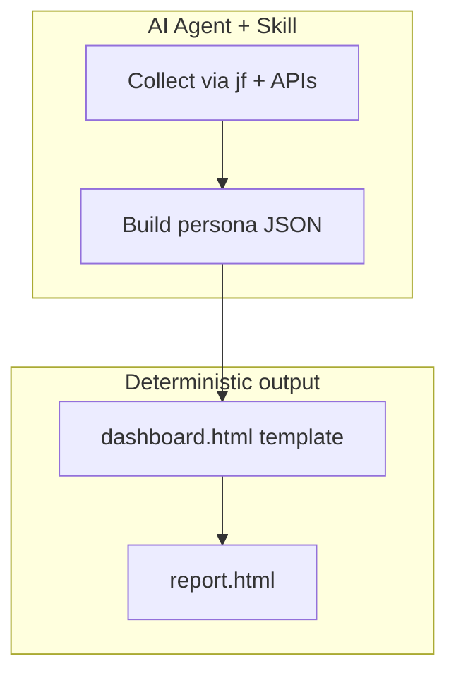

# JFrog Agentic Dashboard Skills

> **Persona-specific security dashboards from live JFrog Platform data** — generated by AI agents, rendered through a fixed HTML template.

[](docs/INSTALL.md)
[](docs/INSTALL.md)
[](docs/INSTALL.md)

Every organization needs different reports. CISOs, engineering leads, and compliance officers all want a different slice of the same platform. This repository delivers **Skills** that agents use to collect live data, build structured JSON, and render **branded, self-contained HTML** dashboards on demand.



---

## Skills in this repo

| Skill | Purpose |
|-------|---------|
| **`jfrog-ciso-report`** | CISO Security & Curation dashboard (production) |
| **`jfrog-dashboard-blueprint`** | Scaffold new persona packs from an interview |

---

## CISO dashboard at a glance

Single HTML file — open in a browser, email to stakeholders, or archive in Artifactory.

| Area | Highlights |
|------|------------|
| **Supply chain (Curation)** | Evaluated / blocked / approved, blocks by reason, audit trail |
| **Vulnerabilities (Xray)** | Violations by type & severity, risk score, critical issue list with context |
| **Compliance** | License and operational risk breakdowns |
| **Executive** | KPI strip, curation vs detection value, recommendations with metadata |
| **Governance (beta)** | Policy effectiveness, watch coverage, threat velocity trends |

---

## Quick start

**1. Prerequisites** — JFrog Platform with Xray, `jf` CLI, `jq`, `python3`, and the base [`jfrog`](https://github.com/jfrog/jfrog-skills) skill.

**2. Configure JFrog CLI server access:**

```bash
jf config add --interactive
```

**3. Install the base skill:**

```bash
npx skills add jfrog -g -y
```

**4. Install `jfrog-ciso-report`**

From GitHub:

```bash
npx skills add git@github.com:liquid-jedi/jfrog-agentic-dashboard-skills.git -g --skill jfrog-ciso-report
```

From a local clone (for development):

```bash
REPO_ROOT="$(pwd)"
npx skills add "$REPO_ROOT" -g --skill jfrog-ciso-report
```

**5. Verify the install:**

```bash
npx skills list -g
```

Expected result: the global skills list includes both `jfrog` and `jfrog-ciso-report`.

**Current shipped versions:** `jfrog-ciso-report` `2.2.0`, `jfrog-dashboard-blueprint` `2.1.1`.
**Previous release versions:** `jfrog-ciso-report` `2.1.1`, `jfrog-dashboard-blueprint` `2.1.0`.

**6. Run the readiness check** (recommended for local-clone installs):

```bash
REPO_ROOT="$(pwd)"
bash "$REPO_ROOT/scripts/agentic-dashboard-prechecks.sh"
```

**7. Run** — ask your agent:

```
Generate a weekly CISO report
```

### Hands-free runs (run, grab coffee, come back)

If your agent keeps asking for confirmation on every tool call, start it in an auto-approval mode first, then paste your report prompt.

Examples:

Claude:

Start: `claude --permission-mode dontAsk`
Then paste: `Generate a weekly CISO report for server <server-id>. Local only. Save local artifacts under /path/to/ciso-reports.`

Codex:

Start: `codex -a never`
Then paste: `Generate a weekly CISO report for server <server-id>. Local only. Save local artifacts under /path/to/ciso-reports.`

Gemini:

Start: `gemini --approval-mode yolo`
Then paste: `Generate a weekly CISO report for server <server-id>. Local only. Save local artifacts under /path/to/ciso-reports.`

Other agent runtimes (Cursor/Cline/Windsurf/Amp): use each tool's workspace approval setting and switch from manual confirmations to auto-approve for non-destructive runs.

Safety note: these modes reduce or skip confirmations. Use only in trusted repositories/workspaces.

Hands-free example prompt (server + local-only storage resolved up front):

```text
Generate a weekly CISO report for server <server-id>. Local only. Save local artifacts under /path/to/ciso-reports.
```

**8. Review shipped example reports** — open any HTML file under `samples/` or `Example Reports/` in a browser to see the output format before connecting to a live JFrog Platform instance.

Examples in this repo:

- `samples/ciso-report-2026-04-26.html`
- `samples/` (additional sample outputs)
- `Example Reports/ciso-reports/liquidjedi/weekly/2026-05-20/report.html`
- `Example Reports/ciso-reports/liquidjedi/weekly/2026-05-26/report.html`

Full install options, GitHub installs, and verification → **[docs/INSTALL.md](docs/INSTALL.md)**

---

## Why agentic reporting?

- **Live data** — reports reflect current platform state, not static exports  
- **Customer-defined priorities** — tune scoring and thresholds in the JSON contract  
- **Consistent UX** — same template every run for comparable executive output  
- **Portable** — works across Claude Code, Cursor, Cline, Windsurf, Amp, and other Skills-capable agents  
- **Inspectable** — JSON-first pipeline is testable and auditable  
- **Extensible** — new personas = new skill + mapping, not a new product  

---

## Documentation

| Doc | Contents |
|-----|----------|
| [**Installation**](docs/INSTALL.md) | Install, verify, update, prechecks, and first report run |
| [**Architecture**](docs/ARCHITECTURE.md) | Data flow, execution contract, file map, new personas |
| [**CISO user manual**](docs/ciso-user-manual.md) | Permissions, agents, interpretation, tuning |
| [**Beta schema**](docs/BETA-SCHEMA.md) | Schema 2.0-beta migration for custom producers |
| [**Troubleshooting**](docs/TROUBLESHOOTING.md) | Common issues and compatibility |

---

## Repository layout

```text
Dashboard-ciso-report-skills/               # CISO skill + renderer
dashboard-blueprint-skills/                 # Persona scaffolder
docs/                                       # Operator guides
samples/                                    # Example HTML reports
Example Reports/                            # Example generated run outputs
scripts/agentic-dashboard-prechecks.sh      # Install / runtime checker
```

## Example reports

The `samples/` and `Example Reports/` folders contain static HTML reports generated from real report payloads and kept as reference output.

- Use them to review layout, tone, and section ordering without installing or configuring anything.
- Open them directly in a browser; they are self-contained HTML files.
- Treat them as examples of report shape and presentation, not as current live platform state.

---

## Recent highlights

- Instance-aware filenames and safe same-day reruns (`rerun-HHMMSS/`)
- Structured local artifacts: `report.html`, `snapshot.json`, `run-meta.json`
- Stable local-root bootstrap on first run (or set `CISO_LOCAL_ROOT` up front)
- Severity panel concentration metrics; resilient curation audit when row events are sparse

**Author:** Avinash Giri

---

## License

See [LICENSE](LICENSE).
