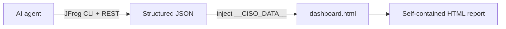

# Architecture

How agentic dashboard skills separate data collection from presentation.

## Overview



| Layer | Responsibility |
|-------|----------------|
| **Skill (agent)** | Live data collection, persona logic, JSON contract |
| **Schema** | Stable field definitions, scoring, recommendations |
| **Template** | Layout, branding, charts — no agent-authored HTML |

Agents provide adaptability; schema + template provide consistency and governance.

---

## Repository layout

```text
Dashboard-ciso-report-skills/         # CISO skill + renderer
dashboard-blueprint-skills/           # Persona scaffolder
docs/                                 # Operator documentation
samples/                              # Example HTML reports
scripts/                              # Prechecks and utilities
```

---

## CISO execution contract

The CISO skill **must not** generate HTML from scratch.

1. Produce JSON matching `report-schema.md`
2. Save to `/tmp/ciso-data.json`
3. Inject into `dashboard.html` by replacing `__CISO_DATA__`
4. Verify exactly one `const DATA = { ... }` in the output

Presentation logic (severity bars, recommendations, sidebar) lives in  
`Dashboard-ciso-report-skills/references/dashboard.html`.

### Runtime checkpoints

- **Server selection** — only when multiple JFrog CLI servers exist and the prompt names none
- **Storage** — defaults to local-only; no extra prompt unless Artifactory is requested
- **API failures** — still emit a report with safe defaults (`0`, `[]`, `false`, `null`) so the UI renders

### Collection rules (summary)

- Curation availability from the **audit API**, not entitlement metadata
- Curation audit window max **168 hours** per request; chunk monthly windows
- Xray violations queries include `created_from` to avoid timeouts
- All `jf` commands pass `--server-id` explicitly

---

## JSON → dashboard mapping

Full contract: `Dashboard-ciso-report-skills/references/report-schema.md`  
API mapping: `Dashboard-ciso-report-skills/references/report-data-collection.md`

| JSON area | Dashboard section |
|-----------|-------------------|
| `meta`, `platform` | Sidebar — URL, watches, policies, curation, indexed repos |
| `curation.*`, `violations.*` | KPI strip and supply-chain / Xray panels |
| `curation.audit_events` | Curation audit table |
| `violations` critical list | Age, exploitability, environments, runbook links |
| `license`, `operational` | Compliance sections (operational when `total > 0`) |
| `governance`, `threat_velocity` | Beta governance and trend panels |
| `comparison` | Period-over-period when `available=true` |
| `recommendations[]` | Priority from structured `priority` + `score` |

---

## Skill file map

```text
Dashboard-ciso-report-skills/
├── SKILL.md
└── references/
    ├── dashboard.html
    ├── report-schema.md
    └── report-data-collection.md
```

| File | Role |
|------|------|
| `SKILL.md` | Workflow orchestration and hard rules |
| `report-schema.md` | Data contract for every field |
| `report-data-collection.md` | API calls and jq mapping |
| `dashboard.html` | Renderer — agent injects JSON only |

The HTML template is a single self-contained file (HTML/CSS/JS). Edit branding or layout in `dashboard.html`; no build step required.

---

## Creating new persona packs

Use `dashboard-blueprint-skills/` to scaffold from a short interview:

```
Prompt: "Scaffold a new dashboard pack for VP Engineering"
```

Output structure:

```text
dashboard-report-skills-vp-engineering/
├── SKILL.md
└── references/
    ├── report-schema.md
    ├── report-data-collection.md
    ├── dashboard.html
    └── sample-data.json
```

The blueprint does **not** call JFrog APIs. Implement mapping in `report-data-collection.md`, then register:

```bash
npx skills add ./dashboard-report-skills-vp-engineering -g -y
```

See `dashboard-blueprint-skills/references/blueprint-structure.md` for the full contract.

---

## Portability

Any agent that supports the Skills framework can run these skills (Claude Code, Cursor, Cline, Windsurf, Amp, and others). The same JSON always produces the same dashboard regardless of which agent collected the data.

---

## Related docs

- [Beta schema migration](BETA-SCHEMA.md)
- [Installation](INSTALL.md)
- [CISO user manual](ciso-user-manual.md)
